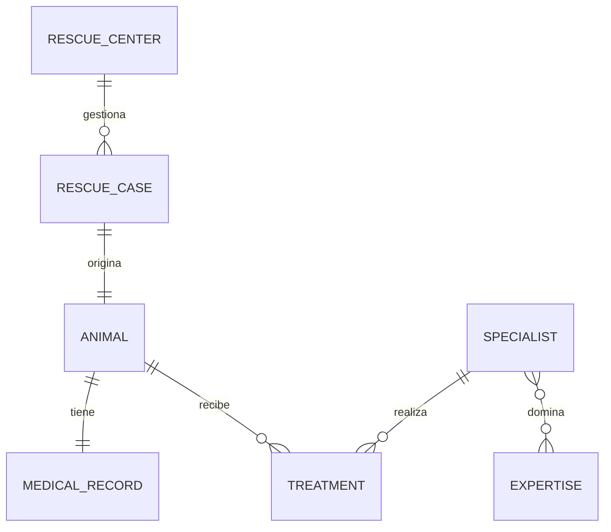
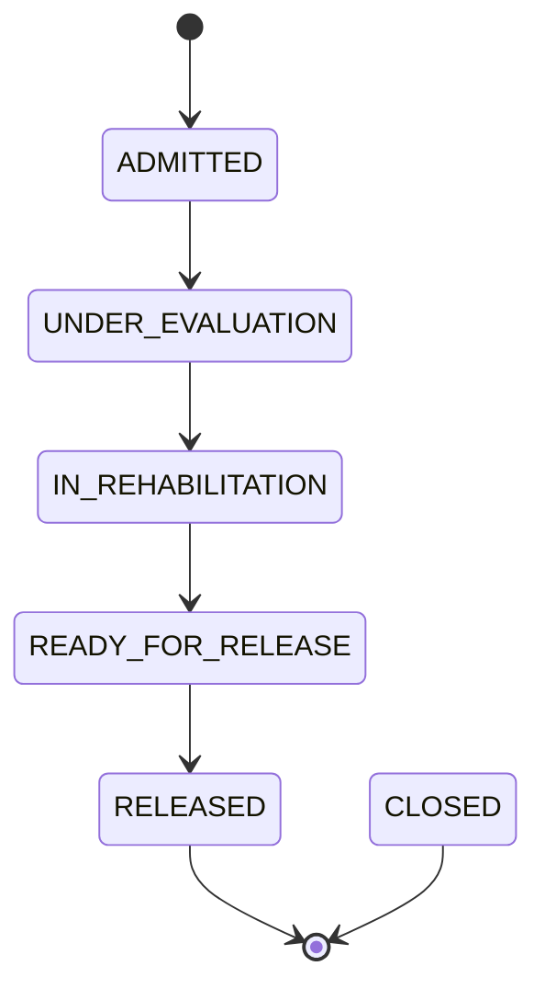

<div align="center">

# 🌊 DeepBlue Rescue

**API REST para centros de rescate y rehabilitación de fauna marina**


`Persistencia` → `Servicio` → `Controlador`

</div>

---

## 📑 Índice

1. [Descripción](#1--descripción)
2. [Arquitectura por capas](#2--arquitectura-por-capas)
3. [Estructura del proyecto](#3--estructura-del-proyecto)
4. [Modelo de datos](#4--modelo-de-datos)
5. [Capa de persistencia](#5--capa-de-persistencia)
6. [Capa de servicio](#6--capa-de-servicio)
7. [Capa controlador (API REST)](#7--capa-controlador-api-rest)
8. [Contrato de errores](#8--contrato-de-errores)
9. [Estrategia de pruebas](#9--estrategia-de-pruebas)
10. [Cómo ejecutar el proyecto](#10--cómo-ejecutar-el-proyecto)
11. [Probar la API con curl](#11--probar-la-api-con-curl)
12. [Decisiones de diseño](#12--decisiones-de-diseño)

---

## 1. 📖 Descripción

**DeepBlue Rescue** modela una plataforma para centros de rescate y rehabilitación de fauna marina: casos de rescate, animales, especialistas y los tratamientos que reciben durante su rehabilitación.

El proyecto se construyó por capas, cada una con una responsabilidad única y su propia estrategia de pruebas:

| Capa | Responsabilidad | Pruebas |
|---|---|---|
| 🗄️ **Persistencia** | Entidades JPA, repositories, migraciones Flyway | Integración con PostgreSQL real (Testcontainers) |
| ⚙️ **Servicio** | Reglas de negocio, transacciones, DTOs, MapStruct | Unit tests (Mockito) |
| 🌐 **Controlador** | Contrato HTTP, validación de entrada, manejo de errores | `@WebMvcTest` + `MockMvc` |

**Stack:** Java 21 · Spring Boot 4.1 · Spring Web MVC · Bean Validation · Spring Data JPA · Hibernate · Flyway · PostgreSQL · MapStruct · JUnit 5 · Mockito · AssertJ · Testcontainers.

---

## 2. 🏛️ Arquitectura por capas

```mermaid
flowchart LR
    C([Cliente HTTP]) -->|JSON| CT

    subgraph API["🌐 Controlador"]
        CT[Controllers<br/>@RestController]
        EH[GlobalExceptionHandler<br/>@RestControllerAdvice]
    end

    subgraph SV["⚙️ Servicio"]
        S[Services<br/>reglas de negocio<br/>@Transactional]
        M[Mappers<br/>MapStruct]
    end

    subgraph PR["🗄️ Persistencia"]
        R[Repositories<br/>Spring Data JPA]
        DB[(PostgreSQL<br/>+ Flyway)]
    end

    CT -->|DTO request| S
    S --> M
    S --> R
    R --> DB
    S -.->|BusinessRuleException<br/>ResourceNotFoundException| EH
    EH -.->|ErrorResponse<br/>400 · 404 · 409 · 500| C
    CT -->|DTO response| C
```

**Regla de oro:** cada capa solo habla con la inmediatamente inferior.

| ❌ Evitado | ✅ Preferido |
|---|---|
| Controller → Repository | Controller → Service → Repository |
| Reglas de negocio en el Controller | Reglas de negocio en el Service |
| Devolver entidades JPA por HTTP | Devolver DTOs (`record`) |
| `try/catch` en cada endpoint | Un único `@RestControllerAdvice` |
| Responder `200` para todo | `200`, `201`, `400`, `404`, `409`, `500` |

---

## 3. 📂 Estructura del proyecto

```text
deepblue-rescue
├── docker-compose.yml
├── pom.xml
└── src
    ├── main
    │   ├── java/com/deepblue/rescue
    │   │   ├── DeepBlueRescueApplication.java
    │   │   ├── domain                  # Entidades JPA y enums
    │   │   ├── repository              # Spring Data JPA (query methods + JPQL)
    │   │   ├── dto
    │   │   │   ├── request             # ChangeRescueStatusRequest, CreateTreatmentRequest
    │   │   │   └── response            # AnimalResponse, RescueCaseResponse, TreatmentResponse,
    │   │   │                           # TreatmentEligibilityResponse, ErrorResponse
    │   │   ├── mapper                  # Interfaces MapStruct (Entity → DTO)
    │   │   ├── exception               # ResourceNotFound, BusinessRule, GlobalExceptionHandler
    │   │   ├── service                 # Interfaces de servicio
    │   │   │   └── impl                # Implementaciones @Service
    │   │   └── controller              # RescueCaseController, TreatmentController, AnimalController
    │   └── resources
    │       ├── application.yml
    │       └── db/migration            # V1, V2, V3 (Flyway)
    └── test/java/com/deepblue/rescue
        ├── PersistenceIntegrationTest.java      # Capa de persistencia (Testcontainers)
        └── controller                           # Capa controlador (@WebMvcTest)
            ├── RescueCaseControllerTest.java
            ├── TreatmentControllerTest.java
            └── AnimalControllerTest.java
```

---

## 4. 🗃️ Modelo de datos

```text
rescue_centers
rescue_cases
animals
medical_records
specialists
expertise
specialist_expertise   (tabla asociativa)
treatments
```

### Relaciones



```text
RescueCenter   1 ────── N   RescueCase
RescueCase     1 ────── 1   Animal
Animal         1 ────── 1   MedicalRecord
Specialist     N ────── M   Expertise   (vía specialist_expertise)
Animal         1 ────── N   Treatment
Specialist     1 ────── N   Treatment
```

### Ciclo de vida de un caso de rescate

Las transiciones de `RescueStatus` son **estrictamente lineales**; cualquier otra se rechaza con `409 Conflict`.



---

## 5. 🗄️ Capa de persistencia

### Flyway

`ddl-auto: validate` está configurado **a propósito**: Hibernate nunca crea ni modifica el esquema, solo lo valida contra lo que ya existe. El esquema real lo crean y evolucionan las migraciones versionadas de `src/main/resources/db/migration`:

| Migración | Contenido |
|---|---|
| `V1__create_schema.sql` | Esquema completo: tablas, PK, FK, UNIQUE, CHECK, índices |
| `V2__insert_expertise_catalog.sql` | Catálogo inicial de áreas de experiencia |
| `V3__add_tracking_device_to_animal.sql` | Evolución del esquema: añade `tracking_device_code` a `animals` sin tocar `V1` |

### Testcontainers

`PersistenceIntegrationTest` anota el contenedor con `@Container` y `@ServiceConnection`, lo que hace que Spring Boot configure automáticamente el `DataSource` contra un PostgreSQL real y efímero, sin tocar `application.yml`. Así las pruebas validan constraints reales (UNIQUE, FK, CHECK) que un H2 en memoria no reproduciría fielmente.

### Query Methods

| Repository | Método |
|---|---|
| `RescueCenterRepository` | `findByCode` |
| `RescueCaseRepository` | `findByCaseCode` · `existsByCaseCode` · `findByStatusOrderByRescueDateAsc` · `findByRescueCenterCode` · `findByRescueDateAfterOrderByRescueDateDesc` |
| `AnimalRepository` | `findByAnimalCode` · `findByCommonNameContainingIgnoreCase` · `findByRescueCaseStatus` · `findByRescueCaseRescueCenterCode` |
| `ExpertiseRepository` | `findByNameIgnoreCase` |
| `TreatmentRepository` | `findByAnimalIdOrderByPerformedAtAsc` |

### Consultas JPQL (`@Query`)

| Método | Propósito |
|---|---|
| `SpecialistRepository.findActiveByExpertise` | Especialistas activos con determinada experiencia |
| `TreatmentRepository.findByPerformedAtBetween` | Tratamientos en un intervalo de fechas |
| `TreatmentRepository.findByAnimalRescueCaseRescueCenterCode` | Tratamientos de un centro (`Treatment → Animal → RescueCase → RescueCenter`) |
| `TreatmentRepository.findBySpecialistExpertise` | Tratamientos por especialistas con cierta experiencia (N:M) |
| `AnimalRepository.findInRehabilitationTreatedBySpecialistWithExpertise` | Reto final: animales en rehabilitación tratados por un especialista con cierta experiencia |

---

## 6. ⚙️ Capa de servicio

Sobre la persistencia se agregó la capa `service/`, que:

- **Expone DTOs (`record`)** en lugar de entidades (`RescueCaseResponse`, `TreatmentResponse`, `AnimalResponse`), transformados con **MapStruct**.
- **Aplica las reglas de negocio** antes de guardar.
- **Distingue** `ResourceNotFoundException` (el recurso no existe) de `BusinessRuleException` (existe, pero la operación no está permitida).
- Usa `@Transactional(readOnly = true)` a nivel de clase y `@Transactional` en los métodos que escriben.
- Se prueba con **unit tests** (JUnit + Mockito + AssertJ), sin levantar Spring ni PostgreSQL: los repositories se reemplazan con `@Mock`.

### Servicios y reglas de negocio

| Servicio | Método | Regla |
|---|---|---|
| `RescueCaseService` | `findByCode` | `404` si el caso no existe |
| | `findByStatus` | Ordenado por fecha de rescate ascendente |
| | `changeStatus` | Solo transiciones lineales válidas (ver diagrama); `404` si no existe |
| `AnimalService` | `findByCode` | `404` si el animal no existe |
| | `findAnimalsInRehabilitation` | Animales cuyo caso está `IN_REHABILITATION` |
| | `canReceiveTreatment` | `true` solo si el caso está `UNDER_EVALUATION` o `IN_REHABILITATION`; `false` si no tiene caso asignado |
| `TreatmentService` | `register` | El animal y el especialista deben existir · el especialista debe estar activo · el caso no puede estar `RELEASED` ni `CLOSED` · la fecha del tratamiento no puede ser anterior a la fecha de rescate |
| | `findByAnimalCode` | Ordenado por fecha del tratamiento ascendente |

---

## 7. 🌐 Capa controlador (API REST)

Los controllers **solo traducen HTTP ↔ DTO**: reciben el JSON, validan la entrada, delegan al Service y devuelven el código de estado correcto. No contienen reglas de negocio ni conocen los repositories.

### Endpoints

Base URL: `http://localhost:8080`

| Método | Ruta | Service invocado | Éxito | Errores posibles |
|---|---|---|:---:|:---:|
| `GET` | `/api/rescue-cases/{caseCode}` | `RescueCaseService.findByCode` | `200` | `404` |
| `GET` | `/api/rescue-cases?status={status}` | `RescueCaseService.findByStatus` | `200` | `400` |
| `PATCH` | `/api/rescue-cases/{caseCode}/status` | `RescueCaseService.changeStatus` | `200` | `400` `404` `409` |
| `POST` | `/api/treatments` | `TreatmentService.register` | `201` | `400` `404` `409` |
| `GET` | `/api/animals/{animalCode}` | `AnimalService.findByCode` | `200` | `404` |
| `GET` | `/api/animals/in-rehabilitation` | `AnimalService.findAnimalsInRehabilitation` | `200` | — |
| `GET` | `/api/animals/{animalCode}/treatments` | `TreatmentService.findByAnimalCode` | `200` | — |
| `GET` | `/api/animals/{animalCode}/treatment-eligibility` | `AnimalService.canReceiveTreatment` | `200` | `404` |

> Cualquier error inesperado responde `500`, una URL inexistente `404` y un método HTTP no soportado `405`.

### Códigos de estado

| Código | Cuándo |
|:---:|---|
| `200 OK` | Consulta o actualización exitosa |
| `201 Created` | `POST /api/treatments`: la operación **crea** un recurso nuevo |
| `400 Bad Request` | JSON inválido, DTO que incumple validaciones, enum o parámetro con valor no válido |
| `404 Not Found` | El recurso no existe (`ResourceNotFoundException`) |
| `409 Conflict` | El recurso existe pero la operación viola una regla de negocio (`BusinessRuleException`) |
| `500 Internal Server Error` | Error inesperado (nunca se expone el detalle interno) |

### Validación de entrada

Se aplica con **Bean Validation** sobre los DTO de request usando `@Valid @RequestBody`.

**`CreateTreatmentRequest`**

| Campo | Regla | Mensaje |
|---|---|---|
| `animalCode` | `@NotBlank` | `Animal code is required` |
| `specialistCode` | `@NotBlank` | `Specialist code is required` |
| `performedAt` | `@NotNull` · `@PastOrPresent` | `Treatment date is required` · `Treatment date cannot be in the future` |
| `type` | `@NotNull` | `Treatment type is required` |
| `description` | `@NotBlank` · `@Size(10..500)` | `Description is required` · `Description must contain between 10 and 500 characters` |

**`ChangeRescueStatusRequest`**

| Campo | Regla | Mensaje |
|---|---|---|
| `status` | `@NotNull` | `Status is required` |

### Ejemplos

<details>
<summary><b>GET</b> <code>/api/rescue-cases/RES-2026-001</code> → 200</summary>

```json
{
  "id": 1,
  "caseCode": "RES-2026-001",
  "rescueDate": "2026-08-20",
  "rescueLocation": "Bahia Concha",
  "status": "IN_REHABILITATION",
  "centerCode": "DB-CAR",
  "animalCode": "AN-2026-001"
}
```
</details>

<details>
<summary><b>PATCH</b> <code>/api/rescue-cases/RES-2026-001/status</code> → 200</summary>

Request:

```json
{ "status": "READY_FOR_RELEASE" }
```

Response: el `RescueCaseResponse` actualizado con `"status": "READY_FOR_RELEASE"`.
</details>

<details>
<summary><b>POST</b> <code>/api/treatments</code> → 201</summary>

Request:

```json
{
  "animalCode": "AN-2026-001",
  "specialistCode": "SPEC-001",
  "performedAt": "2026-08-21T09:00:00",
  "type": "WOUND_CARE",
  "description": "Cleaning and treatment of flipper injury."
}
```

Response:

```json
{
  "id": 100,
  "animalCode": "AN-2026-001",
  "specialistCode": "SPEC-001",
  "performedAt": "2026-08-21T09:00:00",
  "type": "WOUND_CARE",
  "description": "Cleaning and treatment of flipper injury."
}
```
</details>

<details>
<summary><b>GET</b> <code>/api/animals/AN-2026-001/treatment-eligibility</code> → 200</summary>

```json
{
  "animalCode": "AN-2026-001",
  "eligible": true
}
```

`eligible: false` es una respuesta válida (`200`), no un error.
</details>

### Valores de enum aceptados

| Enum | Valores |
|---|---|
| `RescueStatus` | `ADMITTED` · `UNDER_EVALUATION` · `IN_REHABILITATION` · `READY_FOR_RELEASE` · `RELEASED` · `CLOSED` |
| `TreatmentType` | `WOUND_CARE` · `HYDRATION` · `MEDICATION` · `SURGERY` · `NUTRITION` · `PHYSIOTHERAPY` · `OBSERVATION` |
| `AnimalSex` | `MALE` · `FEMALE` · `UNKNOWN` |

---

## 8. 🚨 Contrato de errores

**Todos** los errores de la API devuelven la misma estructura (`ErrorResponse`), generada en un único punto: `GlobalExceptionHandler` (`@RestControllerAdvice`).

```json
{
  "timestamp": "2026-08-21T10:15:30.123",
  "status": 400,
  "error": "Bad Request",
  "message": "Request validation failed",
  "details": {
    "animalCode": "Animal code is required",
    "type": "Treatment type is required"
  }
}
```

| Campo | Descripción |
|---|---|
| `timestamp` | Momento en que ocurrió el error |
| `status` | Código HTTP numérico |
| `error` | Descripción estándar del código HTTP |
| `message` | Mensaje legible para el cliente |
| `details` | Mapa `campo → problema`. Vacío (`{}`) cuando el error no es de un campo concreto |

### Qué excepción produce qué respuesta

| Situación | Excepción | HTTP | `message` |
|---|---|:---:|---|
| DTO inválido | `MethodArgumentNotValidException` | `400` | `Request validation failed` |
| JSON mal formado o enum inexistente | `HttpMessageNotReadableException` | `400` | `Malformed or invalid JSON request` |
| Query param con valor inválido | `MethodArgumentTypeMismatchException` | `400` | `Invalid request parameter` |
| Recurso inexistente | `ResourceNotFoundException` | `404` | Mensaje del Service (`Animal not found: AN-999`) |
| URL inexistente | `NoResourceFoundException` | `404` | `Resource not found` |
| Método HTTP no soportado | `HttpRequestMethodNotSupportedException` | `405` | `HTTP method not supported for this endpoint` |
| Regla de negocio violada | `BusinessRuleException` | `409` | Mensaje del Service |
| Cualquier otro error | `Exception` | `500` | `An unexpected error occurred` |

> 🔒 En el `500` jamás se filtran stack traces, SQL ni mensajes internos: el detalle real queda solo en los logs del servidor.

---

## 9. 🧪 Estrategia de pruebas

Cada capa se prueba con la herramienta adecuada y con un objetivo distinto:

| Capa | Qué se prueba | Herramientas | ¿Necesita Docker/BD? |
|---|---|---|:---:|
| 🗄️ Persistencia | Constraints, queries, mapeo JPA | `@SpringBootTest` + Testcontainers | ✅ Sí |
| ⚙️ Servicio | Reglas de negocio | JUnit + Mockito (repositories `@Mock`) | ❌ No |
| 🌐 Controlador | **Contrato HTTP** | `@WebMvcTest` + `MockMvc` + `@MockitoBean` | ❌ No |

En los tests de controller el **Controller es real** y el **Service es un mock**: se comprueba qué responde la API (status, JSON, validaciones, errores) y que se delega correctamente al Service con `verify(...)` / `verify(..., never())`, sin base de datos.

### Tests del controlador: 27 en total

| Clase | Tests | Cubre |
|---|:---:|---|
| `RescueCaseControllerTest` | 13 | `200`/`404` por código · filtro por status · `400` por status inválido · cambio de estado válido · `400` por body vacío o `null` · `409` por transición inválida · `400` por enum o JSON mal formado · `500` sin filtrar detalles internos · `405` |
| `TreatmentControllerTest` | 7 | `201` · `400` por campos vacíos · descripción corta · fecha futura · enum inválido · `404` animal inexistente · `409` regla de negocio |
| `AnimalControllerTest` | 7 | `200`/`404` por código · en rehabilitación · tratamientos del animal · elegibilidad `true`, `false` y `404` |

### Matriz de trazabilidad: Service → Controller → Test

| Método de Service | Endpoint | Test |
|---|---|---|
| `RescueCaseService.findByCode()` | `GET /api/rescue-cases/{caseCode}` | `shouldReturnRescueCaseByCode` |
| `RescueCaseService.findByStatus()` | `GET /api/rescue-cases?status=` | `shouldReturnCasesByStatus` |
| `RescueCaseService.changeStatus()` | `PATCH /api/rescue-cases/{caseCode}/status` | `shouldChangeStatus` |
| `TreatmentService.register()` | `POST /api/treatments` | `shouldCreateTreatment` |
| `TreatmentService.findByAnimalCode()` | `GET /api/animals/{animalCode}/treatments` | `shouldReturnAnimalTreatments` |
| `AnimalService.findByCode()` | `GET /api/animals/{animalCode}` | `shouldReturnAnimalByCode` |
| `AnimalService.findAnimalsInRehabilitation()` | `GET /api/animals/in-rehabilitation` | `shouldReturnAnimalsInRehabilitation` |
| `AnimalService.canReceiveTreatment()` | `GET /api/animals/{animalCode}/treatment-eligibility` | `shouldReturnTreatmentEligibility` |

---

## 10. 🚀 Cómo ejecutar el proyecto

### Requisitos

- ☕ **JDK 21**
- 📦 **Maven**
- 🐳 **Docker** (para la base de datos y para los tests de persistencia)

### Levantar la aplicación

```bash
docker compose up -d      # PostgreSQL
mvn spring-boot:run       # API en http://localhost:8080
```

Flyway aplica las migraciones automáticamente al arrancar.

### Ejecutar las pruebas

```bash
# Solo la capa controlador (rápido, sin Docker)
mvn test -Dtest='*ControllerTest'

# Toda la suite (los tests de persistencia levantan su propio PostgreSQL con Testcontainers)
mvn clean test
```

Resultado esperado: `BUILD SUCCESS`.

---

## 11. 🔌 Probar la API con curl

> Los códigos (`RES-2026-001`, `AN-2026-001`, `SPEC-001`) son de ejemplo: usa los que existan en tu base de datos.
> En **PowerShell** usa `curl.exe` (y no `curl`, que es un alias de otro comando) o la herramienta que prefieras (Postman, Insomnia, Bruno).

```bash
# Consultar un caso
curl http://localhost:8080/api/rescue-cases/RES-2026-001

# Casos por estado
curl "http://localhost:8080/api/rescue-cases?status=IN_REHABILITATION"

# Cambiar el estado de un caso
curl -X PATCH http://localhost:8080/api/rescue-cases/RES-2026-001/status \
  -H "Content-Type: application/json" \
  -d '{"status": "READY_FOR_RELEASE"}'

# Registrar un tratamiento
curl -X POST http://localhost:8080/api/treatments \
  -H "Content-Type: application/json" \
  -d '{
        "animalCode": "AN-2026-001",
        "specialistCode": "SPEC-001",
        "performedAt": "2026-08-21T09:00:00",
        "type": "WOUND_CARE",
        "description": "Cleaning and treatment of flipper injury."
      }'

# Animales en rehabilitación
curl http://localhost:8080/api/animals/in-rehabilitation

# Tratamientos de un animal
curl http://localhost:8080/api/animals/AN-2026-001/treatments

# ¿Puede recibir tratamiento?
curl http://localhost:8080/api/animals/AN-2026-001/treatment-eligibility
```

Para provocar errores a propósito:

```bash
# 400: status inexistente
curl "http://localhost:8080/api/rescue-cases?status=FLYING"

# 404: animal inexistente
curl http://localhost:8080/api/animals/AN-999

# 409: transición no permitida (ADMITTED → RELEASED)
curl -X PATCH http://localhost:8080/api/rescue-cases/RES-2026-001/status \
  -H "Content-Type: application/json" -d '{"status": "RELEASED"}'
```

---

## 12. 🧠 Decisiones de diseño

| Decisión | Motivo |
|---|---|
| `POST /api/treatments` devuelve **`201`** | La operación crea un recurso nuevo; `200` no comunica eso. |
| El cambio de estado usa **`PATCH`** | Se modifica un solo campo del caso, no se reemplaza todo el recurso (`PUT`). |
| `/api/animals/in-rehabilitation` convive con `/api/animals/{animalCode}` | Spring prioriza la ruta literal sobre la variable, así que no hay ambigüedad. |
| Los tratamientos de un animal se consultan en `/api/animals/{code}/treatments` | La relación es *"los tratamientos **de** un animal"*: el animal es el recurso padre. |
| `eligible: false` responde `200`, no un error | Es un resultado válido de la consulta, no una falla de la petición. |
| Validación **de formato** en el DTO, validación **de negocio** en el Service | El Controller no debe conocer reglas del dominio: `@NotBlank` se verifica en la frontera HTTP; "especialista activo" se verifica donde están los datos. |
| Un único `GlobalExceptionHandler` | Evita duplicar `try/catch` en cada endpoint y garantiza que todos los errores tengan el mismo formato. |
| Handlers específicos para `404` de ruta y `405` | Sin ellos, el handler genérico los convertiría en un `500` engañoso. |
| Los mensajes del `500` son genéricos | Seguridad: no exponer stack traces, SQL ni estructura interna al cliente. |
